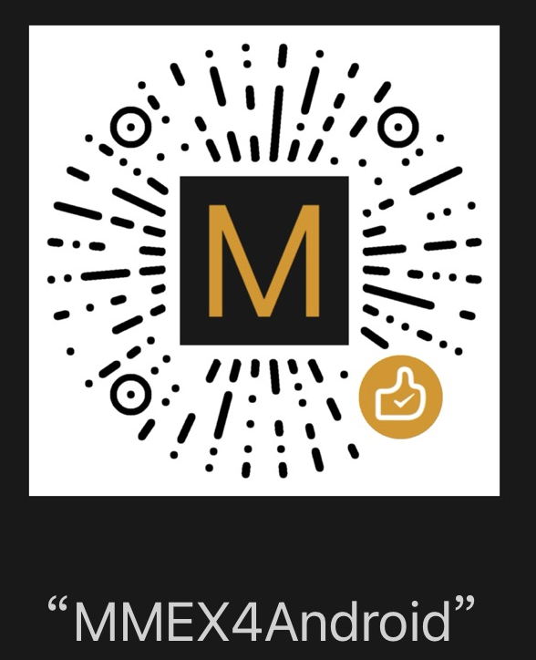
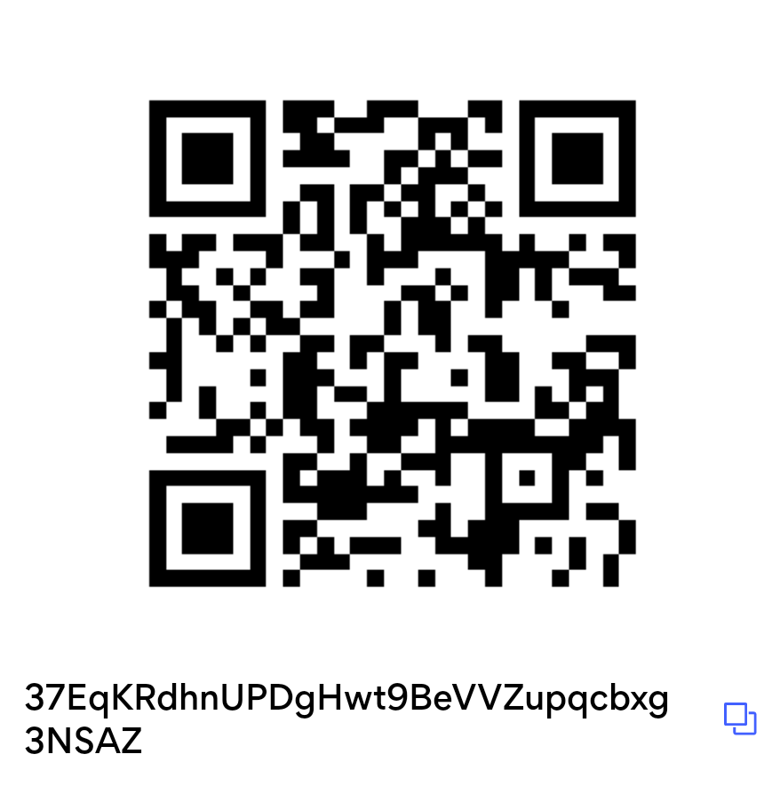



# Money Manager Ex for Android

[Money Manager Ex](https://moneymanagerex.org/) is a free, open-source, cross-platform, easy-to-use personal finance software. It primarily helps organize one's finances and keeps track of where, when, and how the money flows

## Donate
Support our development teams with a coffee.
<table width="100%">
<tr>
<td>

Donate via Paypal 
<form action="https://www.paypal.com/cgi-bin/webscr" method="post" target="_top">
  <input type="hidden" name="cmd" value="_donations">
  <input type="hidden" name="business" value="moneymanagerex@gmail.com">
  <input type="hidden" name="lc" value="US">
  <input type="hidden" name="item_name" value="MoneyManagerEx">
  <input type="hidden" name="no_note" value="0">
  <input type="hidden" name="currency_code" value="USD">
  <input type="hidden" name="bn" value="PP-DonationsBF:btn_donateCC_LG.gif:NonHostedGuest">
  <input type="image" src="assets/images/paypal-donate.png" border="0" name="submit" alt="PayPal - The safer, easier way to pay online!" style="width: 160px; margin: 6px auto;">
  
</form>

</td>
<td>

Donate via WeChat 

</td>
<td>

Donate via bitcoin 

</td>
</tr>
</table>

## Introduction

Money Manager Ex for Android is a port of the desktop personal finance application
[Money Manager Ex](https://moneymanagerex.org/), currently available for Windows, Mac OSX and Linux and iOS.
The Android version mirrors the best features of the desktop version while adding
mobility and database synchronization.

In Money Manager Ex project, we strive to develop good personal finance software that we use ourselves. 
We also do this for fun and the love of programming. We are a non-profit, informal organization although we do accept donations and use them towards the hosting fees.
Any leftovers for the Android version will also go towards acquiring a device for the app testing.

Money Manager Ex is a free, open-source, cross-platform, easy-to-use personal finance software. 
It primarily helps organize one's finances and keeps track of where, when, and how the money goes.
It is also a great tool to get a bird's eye view of your financial worth.

The Android version of Money Manager Ex is aimed at bringing these features to your mobile devices,
allowing you to manage your finances on the go.

## Features

- **Simple Interface:** The app provides an intuitive and user-friendly interface, making it easy for anyone to use.
- **Expense Tracking:** Keep track of your expenses and categorize them for better organization.
- **Income Management:** Monitor your income sources and manage them efficiently.
- **Budget Planning:** Set up budgets for different categories and track your spending to stay within your limits.
- **Reports:** Generate various reports to analyze your financial activities and make informed decisions.
- **Sync:** Synchronize your data across multiple devices using cloud services for seamless access.
- **Security:** Protect your financial data with passwords and encryption to ensure privacy and security.
- **Customization:** Customize categories, currencies, and other settings to suit your specific needs.

All the feature requests can be tracked at our [issue tracker](https://github.com/moneymanagerex/android-money-manager-ex/issues) on GitHub. .

## Download

If you like to contribute you can also enroll as [beta tester](https://play.google.com/apps/testing/com.money.manager.ex.android).

## Screenshot

## Contact
Discussions, questions, and useful advice can be found in the Android [forum](http://forum.moneymanagerex.org/viewforum.php?f=20&sid=e28426f96579a43121b1127cd887e186)

In special situations, you can reach us by email: [android@moneymanagerex.org](mailto:android@moneymanagerex.org). Please note that we do not provide support via email due to the voluntary nature of the project, a fairly small number of project members, and a large number of end users.

## Privacy Policy
Our [Privacy Policy](privacypolicy.md)

## License

Money Manager Ex for Android is released under the [GNU General Public License v3.0](https://www.gnu.org/licenses/gpl-3.0.en.html). You are free to use, modify, and distribute this software in accordance with the terms of the license.

