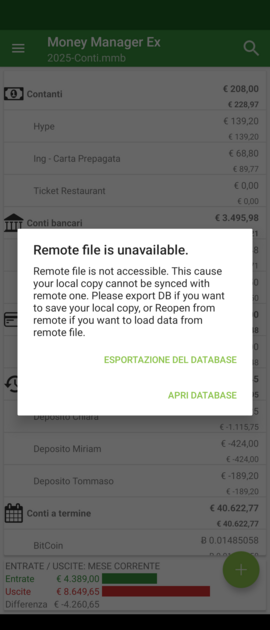

# First setup on Desktop
To use this app as companion app for Desktop version, you will need, of course, to download and install Desktop version from [here](https://moneymanagerex.org/docs/downloads/latest/). Please read also read [Desktop documentation](https://moneymanagerex.org/moneymanagerex/en_US/index.html#section5) to know how to create your db.

## Save your db on cloud provider
From Desktop version, choose "file" -> "save as" and save your db into your preferred cloud provider like in this image

**Notice!** At this point remember, next time you open Desktop version to select the file you saved in your cloud provider
{: .notice--warning}

**Notice!** Any cloud provider that support SAF (Storage Access Framework) will work as cloud provider to sync Money Manager DB. You can check if your Cloud Provider support Android SAF by simply search in google "Android SAF" + your_cloud_provider
{: .notice--info}

**Supported & tested cloud provider**
- Google Drive
- Microsoft OneDrive
- NextCloud
- OwnCloud

## From mobile
Starting with new installation simply select "Open Database" as in this screen

Select the "tree line menu"

Select your cloud provider

Select your file

If your file is ".mmb" left password empty, otherwise insert your secret password (the same used on desktop)

All is done!

To force synchronization you can push it by selecting relative menu item.

### Troubleshooting
If you have issue in sync you can try to fix it making your remote file available offline in remote provider

#### Google Drive
Open Google Drive and navigate to your file

Set it as "Available Offline"

### Microsoft OneDrive
Open Microsoft OneDrive and navigate to your file

Set it as "Available Offline"

### NextCloud / OwnCloud
Open Microsoft OneDrive and navigate to your file

Set it as "Download"

### Sync Conflict
The app is designed to keep your local data in sync with your cloud provider (e.g., Dropbox, Google Drive). However, sync issues may occasionally occur due to network interruptions or concurrent modifications on different devices.

A **Sync Conflict** happens when both the local database on your Android device and the remote file on the cloud have been modified independently. Since the app cannot automatically merge these changes without risking data corruption, it asks for your intervention. **Common cause**: Modifying the database on Windows while the PC is offline, or before the cloud client (Dropbox/OneDrive) has finished updating the local file.

**How to resolve the conflict**
When the app detects a discrepancy, you will see a resolution screen with two options:
* Open Database (Reopen from Remote): Use this if you want to discard the changes made on your Android device and download the latest version from the cloud.
* Database Export (Manual Sync): Use this if your local Android changes are the most important ones. This allows you to export your current local database as a file. You can then manually upload this file to your cloud storage to overwrite the conflicting remote version.

### Sync Issue
There is know issue on some cloud provider that lost connection to remote file. If this occurs, Android App is no longer able to sync file between local and remote provider. This can cause also lost of data.
The app try to check if sync is available and, if not you get and error screen like this:

At this point you can choice if you what to:
* loose your local changes and reopen from remote
* export your data to manually (and externaly) sync or overwrite remote file

### Merge Database 

Starting with version 5.4, an experimental feature called "Merge Database" is available in the app under Setting --> Sync.

When this setting is active, if both your local and remote files have been modified, the app will attempt to identify conflicts. A progress window will be displayed during this potentially lengthy process. Once conflicts are identified, you'll be prompted to choose which version of the file you'd like to keep.
