**Notice!** This documentation is incomplete
{: .notice--warning}

# First setup on Desktop
To use this app as companion app for Desktop version, you will need, of course, to download and install Desktop version from [here](https://moneymanagerex.org/docs/downloads/latest/). Please read also read [Desktop documentation](https://moneymanagerex.org/moneymanagerex/en_US/index.html#section5) to know how to create your db.

## Save your db on cloud provider
From Desktop version, choose "file" -> "save as" and save your db into your preferred cloud provider like in this image
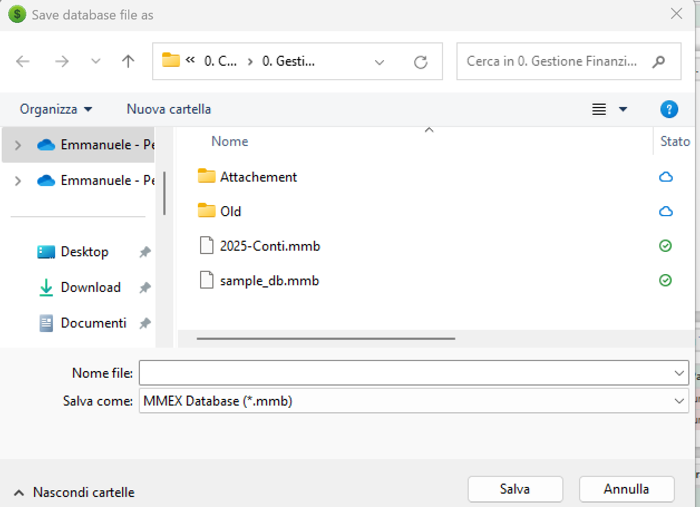

**Notice!** At this point remember, next time you open Desktop version to select the file you saved in your cloud provider
{: .notice--warning}

**Notice!** Any cloud provider that support SAF (Storage Access Framework) will work as cloud provider to sync Money Manager DB. You can check if your Cloud Provider support Android SAF by simply search in google "Android SAF" + <your cloud provider>
{: .notice--info}

**Supported & tested cloud provider**
- Google Drive
- Microsoft OneDrive
- NextCloud
- OwnCloud

## From mobile
Starting with new installation simply select "Open Database" as in this screen
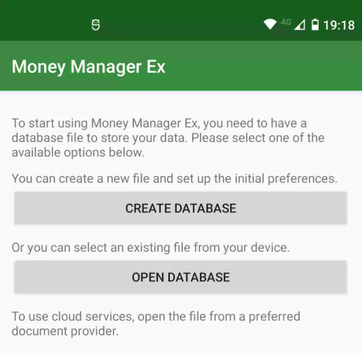

Select the "tree line menu"
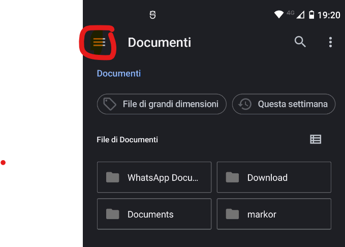

Select your cloud provider
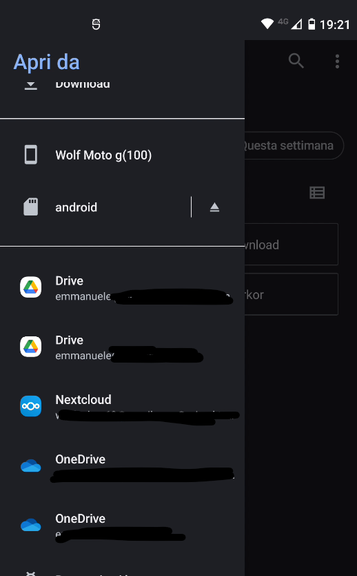

Select your file

If your file is ".mmb" left password empty, otherwise insert your secret password (the same used on desktop)
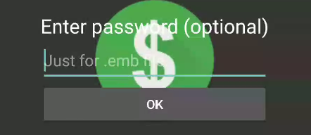

All is done!
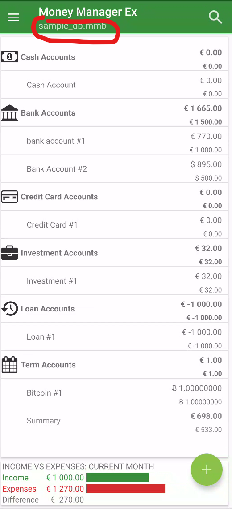

To force synchronization you can push it by selecting relative menu item.
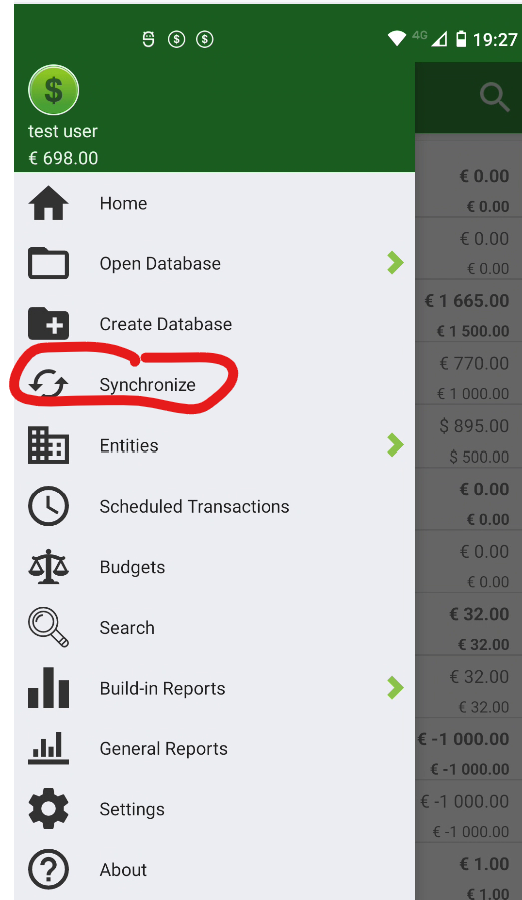

### Troubleshooting
If you have issue in sync you can try to fix it making your remote file available offline in remote provider

#### Google Drive
Open Google Drive and navigate to your file
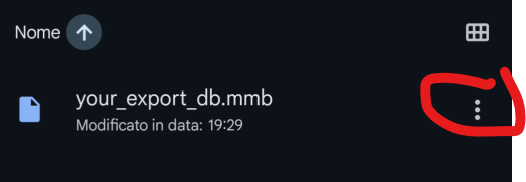

Set it as "Available Offline"
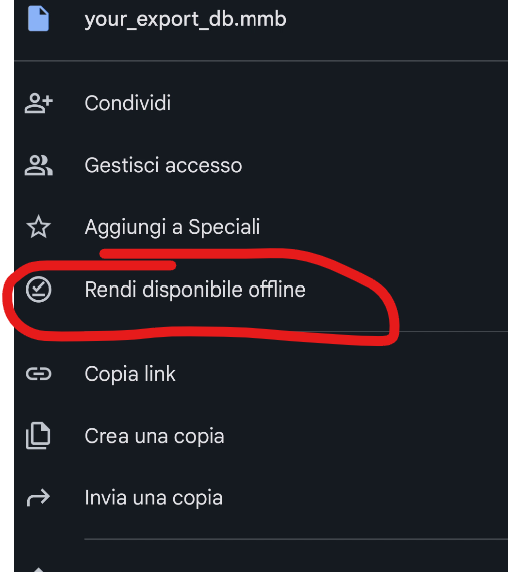

### Microsoft OneDrive
Open Microsoft OneDrive and navigate to your file
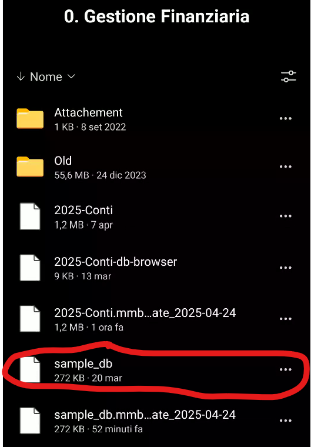

Set it as "Available Offline"
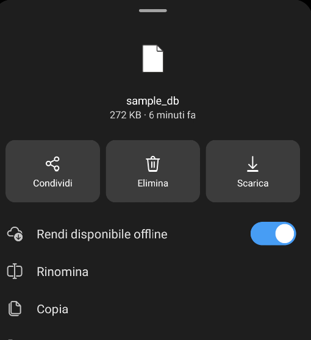

### NextCloud / OwnCloud
Open Microsoft OneDrive and navigate to your file
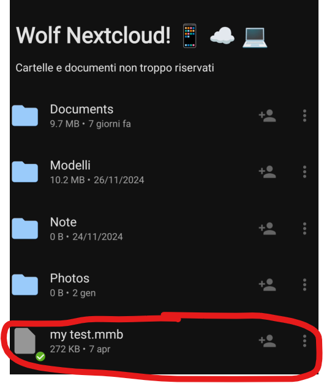

Set it as "Download"
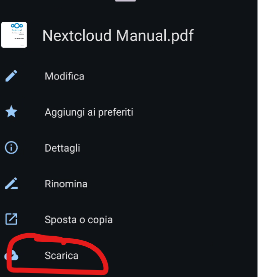