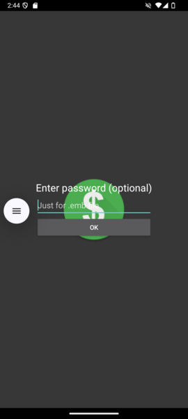
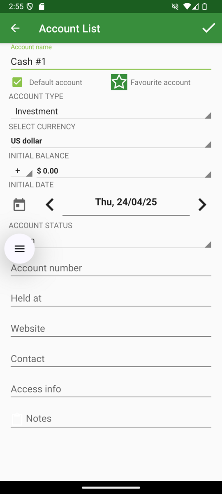

# First setup
Open Android Money Manager Ex for Android from menu. If welcome screen is shown, close it.

Choose create Database, and specify your db name, with extension ".mmb". Notice: don't use an already used name for your database.

On next screen left password bank (is request only if you your encripted DB).

Select Create New Account, to create first mandatory account.

Fill your first account data, for example "Cash #1". If you plan to use this as main account for enter transaction set also as default.
Chose the correct type for account, for example for Cash use "Cash" (also take a look to [desktop documentation](https://moneymanagerex.org/moneymanagerex/en_US/index.html#section6)). Select also currency, Initial balance and open date (keep in mind that you cannot enter transaction before account opening date).

Finally you get your db ready to use. Enjoy.