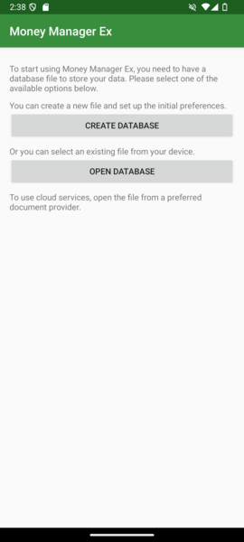
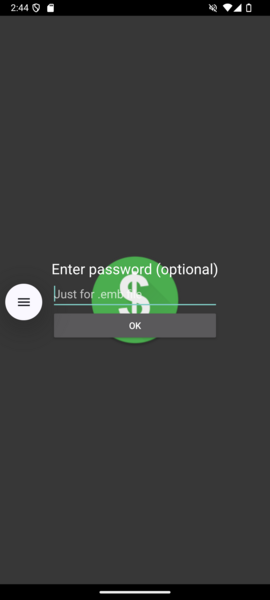
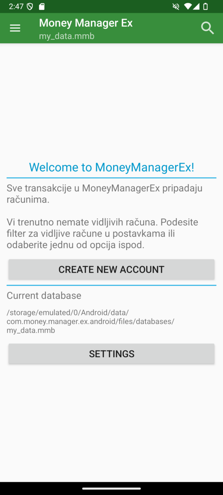
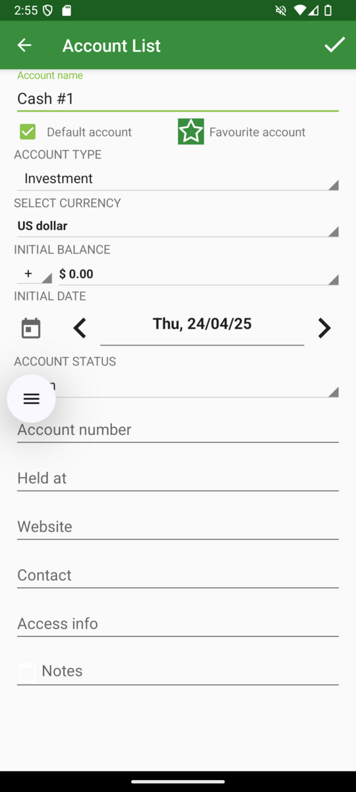
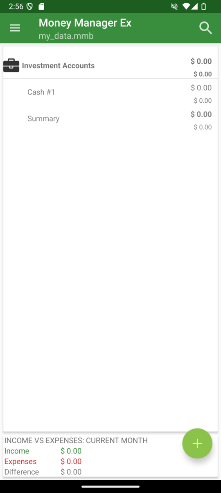

# First setup
Open Money Manager Ex for Android from the app menu. If the welcome screen is shown, close it.

Choose "Create Database", and specify your db name with extension ".mmb".

Notice: don't use an already used name for your database, because during the "create" process Android prevents overwriting any existing file. The effect is that it seems you have a new file, but all operations are forbidden.
{: .notice--danger}

On the next screen leave the password blank (it is required only for your encrypted DB).

Select Create New Account, to create first mandatory account.

Fill your first account details, for example "Cash #1". If you plan to use this as the main account for entering transactions, set it as default.
Choose the correct type for the account, for example for cash use "Cash" (also take a look at [desktop documentation](https://moneymanagerex.org/moneymanagerex/en_US/index.html#section6)). Select currency, initial balance, and open date (keep in mind that you cannot enter transactions before the account opening date).

Finally, your DB is ready to use. Enjoy.