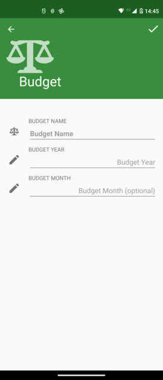
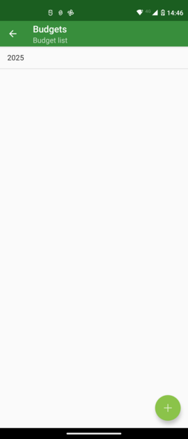
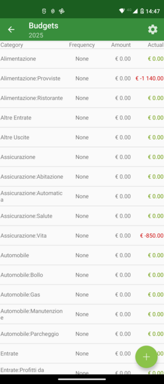
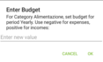

Budgets are used to set up monthly or yearly amounts and compare budgeted values with both expenses and forecasts.
Take a look also on documentation for [destkop version](https://moneymanagerex.org/moneymanagerex/en_US/budget.html).

# Setting Up a Budget

From the initial budget screen, press the "+" button to add a new budget.

Enter the year and optionally the month (if you want to have a monthly budget).

Your budget will appear in the list. Select it.

## Operating with a Budget
A long press on the budget name will display a context menu where you can edit (change year/month) or delete it. Deleting a budget will not affect your transactions; only the budget itself will be modified or deleted.

# Managing Budgets
Budget Details show all categories with budget, actual, and forecast information.

From the upper-right gear icon, you can:
- **Reload scheduled transactions**: This forces a reload from your recurring transactions and evaluates their impact on the budget.
- **Show simple budget view**: This displays a simplified view of the budget.
- **Use financial year**: This allows you to compare the budget to a financial year (useful if your budget period doesn't align with the calendar year). See the app settings for details regarding the financial year.
- **Select visible columns**: This lets you choose which columns will be visible in the list. Available columns are:
  - **Frequency**: Indicates how often the budget value applies. Currently, on mobile, while all frequencies are supported if entered from the desktop version, this is tied to the budget type. For a Yearly budget, the frequency is Year; for a Monthly budget, the frequency is monthly. Refer to the desktop version for more information.
  - **Amount**: The budgeted amount.
  - **Estimate**: The computed value for the period. For example, if you have a Weekly frequency of €10 and are in a Yearly budget, the value shown is €520 (52 * €10).
  - **Actual**: The total expenses for this category within the budget period. This value comes from your transactions.
  - **Available**: The remaining amount, calculated as **Estimate** - **Actual**.
  - **Forecast Remain**: The projected remaining amount, calculated as **Estimate** - **Actual** - **[sum of recurring transactions within the budget period]**.

## Setting Up Category Budgets

From the budget category list, a long press on a category allows you to:
- **Edit**: Set up or modify the budget **Amount**.
- **Delete**: Remove the budget information for that category.
- **View Transactions**: See the transactions that contribute to the "**Actual**" value.

Choosing "**Edit**" will allow you to set **frequency**  and a **value** for that category relative to the budget.

Use negative. values for expenses and positive values for income. For example, setting "_Salary_" to "+€12,000" in a Yearly budget means that you **receive** €1,000 per month. Set "_Grocery_" to "-6.000€" means that you **spend** 500€ per month.

## table for frequency
This are all supported frequency from desktop.

**Notice** From release 5.4 it's possible to define budget frequency also on mobile. 
{: .notice--warning}

| Key    | annual occurences | Result for Year | Result for Month                        |
| -------|-------------------|-----------------|-----------------------------------------|
| None            | 0                 | amount * 0      | amount * 0 / 12 = 0                     |
| Weekly          | 52                | amount * 52     | amount * 52  / 12 = amount * 4,33  |
| Fortnightly     | 26                | amount * 26     | amount * 26  / 12 = amount * 2,16  |
| Monthly         | 12                | amount * 12     | amount * 12  / 12 = amount        |
| Every 2 Months  | 6                 | amount * 6      | amount * 6   / 12 = amount / 2      |
| Quarterly       | 4                 | amount * 4      | amount * 4   / 12 = amount / 3      |
| Half-Yearly     | 2                 | amount * 2      | amount * 2   / 12 = amount / 6      |
| Yearly          | 1                 | amount * 1      | amount * 1   / 12 = amount / 12    |
| Daily           | 365               | amount * 365    | amount * 365 / 12 = amount * 30,41  |

