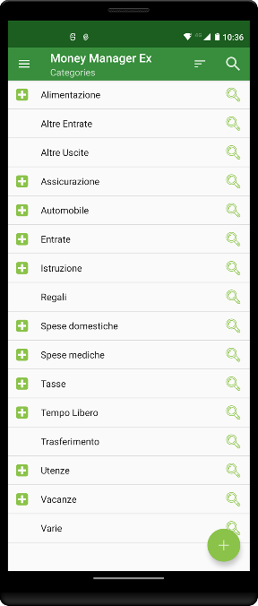
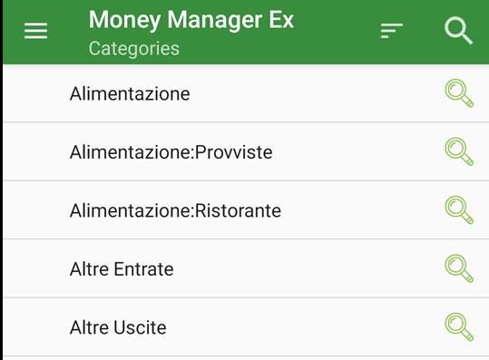
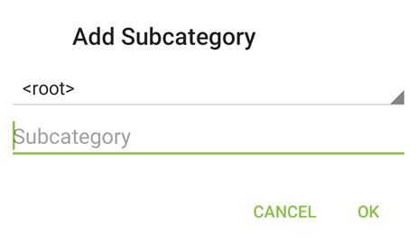

Category are used to classify where your moneys go/come from.

{: .align-right}

From category screen (reachable from Menu->Entity->Category) you see the list of all categories.
Main functions are:
- **search** using search button from top-right. This search in all category level.
- **sort by _Name_**: alphabetical sort from a to z.
- **Sort by usage**: _frequency_ of category in transaction. First category is most used.
- **Sort by recent**: by _last used_ category in transaction. First category is latest used.
- **Show inactive**: how also category that has been deactivated. This category is no longer selectable in transaction.
- **Navigation mode**: this allow to switch from Hierarchy view to flat view. This is useful if you use it in combination of sort by recent or by usage because at top of list you get all category and subcategory based on absolute frequency or usage.

Keep in mind that Categories is not translated once they has been created.
{: .notice--warning}

Sample view of Category in **Flat View** mode 

# Navigating in categories

When you are in "Tree View" mode, you category show some contextual information.

{: .align-center}

"**+**" button on the left show that category has children and allow you to navigate into. "**lens**" button on right open the [contextual menu](#contextual-menu-in-category) for that category.

# Setup a Category

{: .align-right}

To add new category simply press "+" button on bottom right. This show a popup with "\<root\>" as parent category and subcategory name.
\<root\> stand for top level. So if you add category with "\<root\>" as parent category this appears in the fist level.
You can anyway select any parent category while create new category.

## Contextual menu in category

Long-press a category (or press _lens_ button on the right of a category) will show a contextual menu:
- **Add Subcategory**: This allow you to add subcategory of for a category. It's the same of press "+" in main category screen and select this category as parent category.
- **Edit**: Edit this category, to change its name.
- **Delete**: Permanent delete a category
- **View Transaction**: View all transaction that belong to this category
- **View Transaction with subcategories**: View all transaction that has this category or any of its children.
- **Switch Active/Inactive**: Make this category active or inactive. You can set category as inactive even if is used in transaction, but you cannot save a transaction with an inactive category.

You can't delete category that it is used in transaction. You can _Deactivate_ it, but if you want to delete you need to manually go in every transaction and change the category before you are able to delete.
{: .notice--warning}

Inactive category can be show in the list selecting in the top menu the "**Show inactive**" flag. Inactive category is shown in the list with "_[inactive]_" next to category name.
{: .notice--info}