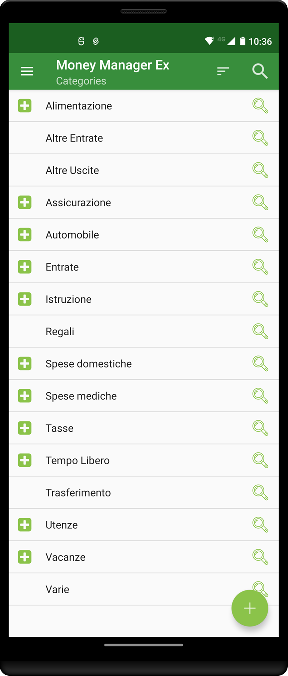
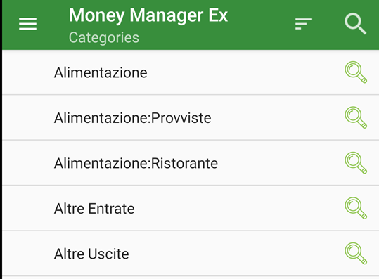
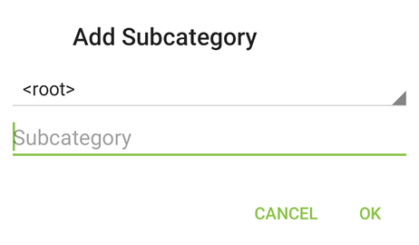

Categories are used to classify where your money goes/comes from.

{: .align-right}

From category screen (reachable from Menu->Entity->Category) you see the list of all categories.
Main functions are:
- **search** using the search button from top-right. This searches across all category levels.
- **sort by _Name_**: alphabetical sort from a to z.
- **Sort by usage**: _frequency_ of category in transaction. First category is most used.
- **Sort by recent**: by _last used_ category in transaction. First category is latest used.
- **Show inactive**: show also categories that have been deactivated. These categories are no longer selectable in transactions.
- **Navigation mode**: this allows switching from Hierarchy view to flat view. This is useful if you use it in combination with sort by recent or by usage because at the top of the list you get all categories and subcategories based on absolute frequency or usage.

Keep in mind that categories are not translated once they have been created.
{: .notice--warning}

Sample view of Category in **Flat View** mode

# Navigating in categories

When you are in "Tree View" mode, your categories show some contextual information.

{: .align-center}

"**+**" button on the left shows that a category has children and allows you to navigate into it. "**lens**" button on the right opens the [contextual menu](#contextual-menu-in-category) for that category.

# Setup a Category

{: .align-right}

To add a new category simply press "+" button on bottom right. This shows a popup with "\<root\>" as parent category and subcategory name.
\<root\> stands for top level. So if you add a category with "\<root\>" as parent category this appears in the first level.
You can still select any parent category while creating a new category.

## Contextual menu in category

Long-press a category (or press _lens_ button on the right of a category) to show a contextual menu:
- **Add Subcategory**: This allows you to add a subcategory for a category. It's the same as pressing "+" in the main category screen and selecting this category as parent category.
- **Edit**: Edit this category, to change its name.
- **Delete**: Permanently delete a category
- **View Transaction**: View all transactions that belong to this category
- **View Transaction with subcategories**: View all transactions that have this category or any of its children.
- **Switch Active/Inactive**: Make this category active or inactive. You can set a category as inactive even if it is used in transactions, but you cannot save a transaction with an inactive category.

You can't delete a category that is used in transactions. You can _Deactivate_ it, but if you want to delete it you need to manually go into every transaction and change the category first.
{: .notice--warning}

Inactive categories can be shown in the list by selecting "**Show inactive**" in the top menu. Inactive categories are shown in the list with "_[inactive]_" next to the category name.
{: .notice--info}