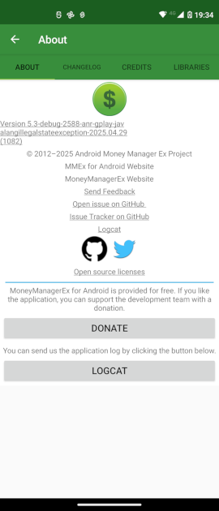

Settings alows you to manage different aspect of the App.

# General

General settings allow you to manage general information of the app such as:

- **Application Language**: application language user interface
- **Theme**: Material light or Material Dark
- **Default Status**: default status for transaction. This is default value when enter transaction. See [here](/usermanual/add_transaction/#transaction).
- **Default Payee**: this is the default payee in transaction
- **Send Anonymous usage data**: this allow to send anonymous information on your device for statical regarding usage of this app.

# Per-Database

this settings allow to control basic information at dB level. This information is shared with desktop version.

- **user**: username in the app.
- **Base Currency**: default currency in the app.
- **Default Account**: default account used from home screen when enter transaction using "+" button.
- **Date Format**: Date Format used in all report and transactions 
- **Financial Year: Start day**: start day of financial year 
- **Financial Year: Start month**: start month of financial year
> **Financial Year** concept: A financial year is a 12-month period used for accounting and financial reporting purposes. this can be different from the calendar year. For example if you set financial day as 15 and financial month as April, the financial year start at April, 15 and end at April, 14 of next year.
- **Attachments folder**: folder where attachment are saved. this function is not fully implemented.

# Look & Feel

Thos setting is local to android app.

- **View Open Account**: view only open account. if not set also closed account will be shown in homepage.
- **View favorite account**: if set only favorite account is shown. Otherwise all account is shown.
- **Show transaction**: default timeframe for list transaction. Available value are: today, 
last 7 days, last 2 week.... and many other
- **Show balance for each transaction**: enabling this setting for every transaction is shown also account balance. This requires more resources to compute.
- **Hide reconcile transaction**: hide reconcile transaction from list. Reconcile transaction are transaction that has paired and confirmed.
- **Application Font**: select your prefered font for app.
- **Application Font Size**: size of font.

# Behaviour 

- **Process Schedule Transaction**: this enable schedule transaction to be processed. If this is not enable schedule transaction are **NOT** automatic posted. See status meaning [here](/usermanual/#recurring-transactions)

- **Notification time**: at what time schedule engine check overdue schedule transaction.

- **Filter in selection**: TBD

- **Search by text Content...**: if enabled all search function work searching text into whole fields. If not search work only by searching field that begins with specific text.

- **Process Bank Transaction**: this enable app to access to your SMS to read Bank SMS and try to automatically create transaction into DB.

- **Auto Populate Transaction Number**: will automatically set transaction number while enter transaction.

# Synchronization 

To setup synchronization see [here](/quickstart/start_companion/).

- **Synchronized Interval**: how frequently app will synchronized with remote file.
- **Download**: Allow you to force download of DataBase from Remote Provider
- **Upload**: Allow you to force upload of Databse to remote provider
- **Sync on Start**: Allow synchronization at start of application.
- **Auto sync only on WiFi**: Allow synchronization only when you are in WiFi. Normally mobile data will used.
- **Reset preference**: Reset all this preference to default.

# Investment 
_ToDo_

# Budget

This setting are also available in [Budget view](/usermanual/budget/index#managing-budgets). 
You can change this setting both from here and in Budget View.

- **Show simple budget view**: This displays a simplified view of the budget.
- **Use financial year**: This allows you to compare the budget to a financial year (useful if your budget period doesn't align with the calendar year). See the app settings for details regarding the financial year. For detail read [Financial Year](/usermanual/settings/#per-database)

# Security 

- **Activate Passcode**: This enable a passcode (numeric code) request when app is open. **Notice** this protect app, not your DB.
- **Edit Passcode**: Change the app Passcode.
- **Delete Passcode**: Remove app passcode
- **Fingerprint Authentication**: When passcode is enable allow you to use Fingerprint to open app. **Notice** this protect app, not your DB.

If you need to protect your DB, consider to use encrypted DB with extension **emb**. 
Notice that encrypted DB is slower that normal db.
{: .notice--danger}

# Database
This screen show important information regarding your DB and is useful to share a this screen if you open a ticket no github.

- **Database path**: This is internal DB path and name.
- **Remote path**: This is external path of your DB. _Keep in mind that, in according with SAF, we consider "remote" also file on internal memory or SD.
- **Database version**: This show internal DB version and you need to use Android and Desktop version that use same DB version compatibility.
- **Clear Recent File**: This show how many file did you have in your "Recent" file, accessible via main menu "Open Database". Selecting this recent file cache will be cleared.
- **Export Database**: This will create a copy (export) of internal database. You need to specify where you want to save. **Notice**: please specify a non existing file to prevent overwrite.
- **Check DB Integrity**: This will check if you DB is corrupted.
- **Check DB Schema**: This will check DB schema to verify if any table is missing
- **Fix Duplicate Record**: This will check and fix some known DB error
- **SQLite version**: current SQLite engine used by the app

# Info

This screen show useful information regarding the app, and allow you to ask for help.

{: .align-right}

This screen show information regargin "**Version**" of app, allow you to "**Send a feedback**", or "**Open issue on github**", view "**Issue Tracker on github**", send the "**logcat**" and finally make "**Donation**"
