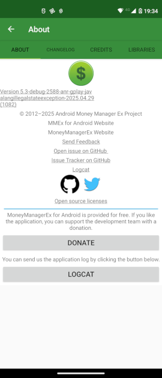

Settings allows you to manage different aspects of the app.

# General

General settings allow you to manage app-wide information such as:

- **Application Language**: application language user interface
- **Theme**: Material light or Material Dark
- **Default Status**: default status for transactions. This is the default value when entering a transaction. See [here](/usermanual/add_transaction/#transaction).
- **Default Payee**: this is the default payee in transaction
- **Send Anonymous usage data**: this allows sending anonymous usage statistics from your device.

# Per-Database

These settings allow you to control basic information at DB level. This information is shared with the desktop version.

- **user**: username in the app.
- **Base Currency**: default currency in the app.
- **Default Account**: default account used from the home screen when entering a transaction using "+" button.
- **Date Format**: date format used in all reports and transactions
- **Financial Year: Start day**: start day of financial year
- **Financial Year: Start month**: start month of financial year
> **Financial Year** concept: A financial year is a 12-month period used for accounting and financial reporting purposes. This can be different from the calendar year. For example, if you set the financial day as 15 and the financial month as April, the financial year starts on April 15 and ends on April 14 of the next year.
- **Attachments folder**: folder where attachments are saved. This function is not fully implemented.

# Look & Feel

These settings are local to the Android app.

- **View Open Account**: view only open accounts. If not set, closed accounts will also be shown on the homepage.
- **View favorite account**: if set, only favorite accounts are shown. Otherwise all accounts are shown.
- **Show transaction**: default timeframe for the transaction list. Available values are: today,
last 7 days, last 2 weeks.... and many others
- **Show balance for each transaction**: when enabled, each transaction also shows account balance. This requires more resources to compute.
- **Hide reconcile transaction**: hide reconciled transactions from the list. Reconciled transactions are transactions that have been paired and confirmed.
- **Application Font**: select your preferred font for the app.
- **Application Font Size**: size of font.

# Behaviour

- **Process Schedule Transaction**: this enables scheduled transactions to be processed. If this is not enabled, scheduled transactions are **NOT** automatically posted. See status meaning [here](/usermanual/#recurring-transactions)

- **Notification time**: at what time the schedule engine checks overdue scheduled transactions.

- **Filter in selection**: TBD

- **Search by text Content...**: if enabled, search functions work by searching text in whole fields. If not enabled, search works only on fields that begin with the specific text.

- **Process Bank Transaction**: this enables the app to access your SMS to read bank SMS messages and try to automatically create transactions in the DB.

- **Auto Populate Transaction Number**: will automatically set the transaction number while entering a transaction.

# Synchronization

To set up synchronization see [here](/quickstart/start_companion/).

- **Synchronized Interval**: how frequently the app will synchronize with the remote file.
- **Download**: Allow you to force download of DataBase from Remote Provider
- **Upload**: Allow you to force upload of Database to remote provider
- **Sync on Start**: Allow synchronization at start of application.
- **Auto sync only on WiFi**: Allow synchronization only when you are on WiFi. Normally, mobile data will be used.
- **Merge Database**: Enable Merge Database functionality
- **Reset preference**: Reset all these preferences to default.

**Notice**  Starting with version 5.4, an experimental feature called "Merge Database" is available in the app under APP --> Sync. When this setting is active, if both your local and remote files have been modified, the app will attempt to identify conflicts. A progress window will be displayed during this potentially lengthy process. Once conflicts are identified, you'll be prompted to choose which version of the file you'd like to keep.
{: .notice--warning}

# Investment
_ToDo_

# Budget

These settings are also available in [Budget view](/usermanual/budget/index#managing-budgets).
You can change these settings both from here and in Budget View.

- **Show simple budget view**: This displays a simplified view of the budget.
- **Use financial year**: This allows you to compare the budget to a financial year (useful if your budget period doesn't align with the calendar year). See the app settings for details regarding the financial year. For details read [Financial Year](/usermanual/settings/#per-database)

# Security

- **Activate Passcode**: This enables a passcode (numeric code) request when the app is open. **Notice** this protects the app, not your DB.
- **Edit Passcode**: Change the app Passcode.
- **Delete Passcode**: Remove app passcode
- **Fingerprint Authentication**: When passcode is enabled, this allows you to use fingerprint to open the app. **Notice** this protects the app, not your DB.

If you need to protect your DB, consider using an encrypted DB with extension **emb**.
Notice that an encrypted DB is slower than a normal DB.
{: .notice--danger}

# Database
This screen shows important information regarding your DB and is useful to share if you open a ticket on GitHub.

- **Database path**: This is internal DB path and name.
- **Remote path**: This is the external path of your DB. _Keep in mind that, according to SAF, we also consider files on internal memory or SD as "remote".
- **Database version**: This shows the internal DB version, and you need to use Android and Desktop versions that use the same DB version compatibility.
- **Clear Recent File**: This shows how many files you have in your "Recent" list, accessible via main menu "Open Database". Selecting this clears the recent file cache.
- **Export Database**: This will create a copy (export) of internal database. You need to specify where you want to save. **Notice**: please specify a non-existing file to prevent overwrite.
- **Check DB Integrity**: This will check if your DB is corrupted.
- **Check DB Schema**: This will check DB schema to verify if any table is missing
- **Fix Duplicate Record**: This will check and fix some known DB errors
- **SQLite version**: current SQLite engine used by the app

# Info

This screen shows useful information regarding the app, and allows you to ask for help.

{: .align-right}

This screen shows information regarding app "**Version**", allows you to "**[Send feedback](mailto:android@moneymanagerex.org)**", or "**[Open issue on GitHub](https://github.com/moneymanagerex/android-money-manager-ex/issues)**", view "**[Issue Tracker on GitHub](https://github.com/moneymanagerex/android-money-manager-ex/issues)**", send the "**logcat**", and finally make a "**Donation**"
